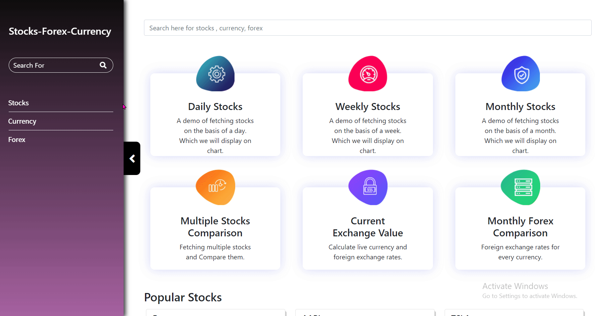

# Technology used

HTML, CSS, JavaScript, React.js,React-Hooks, React-Router-dom v6,
Grid System of Bootstrap, HighCharts, Lodash, Axios, concept of debouncing 

### Learn to visualize the live Stocks, Forex or your organization data using Highcharts library in React JS with Redux.

:ballot_box_with_check:Here are the scenarios -

Learn how to integrate Highcharts library in React JS for data visualization.

You will display charts for live Stocks data and Forex data using Highstocks chart.

Use custom REST APIs developed using Express JS, Node JS and Mongo DB of your organization and 

display charts using Highcharts with drag and drop functionality. 

Compare different company stocks. Compare different country currency trends.

## Here it is :100:

### What i have learned

#### :black_nib:Integrate Highcharts Library in React SPA.

#### :black_nib:Working with user events and state to create interactive applications.

#### :black_nib:Visualize live Stocks and Forex data using HighStocks charts.

#### :black_nib:React Hooks (in-depth)! ex. useSelector , useState, useEffect, useDispatch etc.

#### :black_nib:Class-based components and functional components.

#### :black_nib:Compare different company stocks.

#### :black_nib:Routing with React Router.

#### :black_nib:Visualize stocks and currencies data using Candlestick chart and OHLC charts

#### :black_nib:Customize Highstocks charts.

#### :black_nib:Applied the concept of debouncing in the search functionality.

#### :black_nib:Display Candlestick, OHLC charts and customize Highstocks charts.

